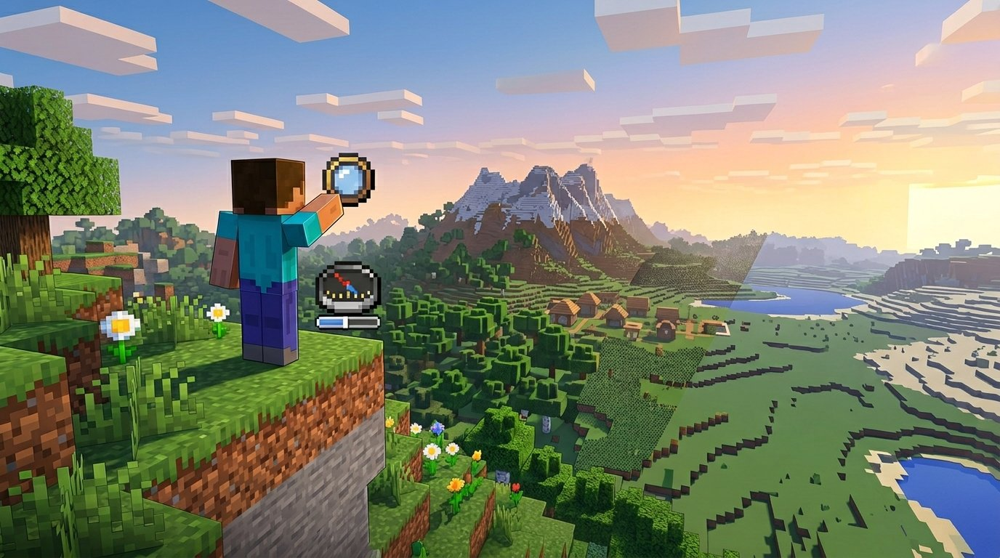

  

<h1 align="center">FPS Horizon</h1>

  
  
  
  

---

## 🇬🇧 English

**FPS Horizon** is a client-side Forge mod for Minecraft that dynamically adjusts the render distance based on your average FPS, keeping the game smooth without any manual tweaking.

### ✨ Features

- **Dynamic render distance** — automatically increases or decreases render distance based on your average FPS
- **Animated fog transitions** — a smooth distance fog opens and closes during render distance changes, hiding chunk pop-in completely
- **Real-time configuration** — all settings can be changed in-game from the Mods menu without restarting
- **Embeddium compatible** — fully integrated with Embeddium's rendering pipeline via Mixins
- **Lightweight** — runs entirely on client side, no server needed

### 📋 Requirements

| Dependency | Version |
|---|---|
| Minecraft | Java |
| Forge | 47.4.10+ |
| Embeddium | 0.3.31+ |

### ⚙️ Configuration

All options are available in-game via **Mods → FPS Horizon → Config**.

#### FPS Control
| Option | Default | Description |
|---|---|---|
| Min FPS | 30 | If average FPS drops below this, render distance decreases |
| Max FPS | 50 | If average FPS exceeds this, render distance increases |
| FPS Samples | 15 | Number of FPS samples to average before deciding a change |

#### Render Distance
| Option | Default | Description |
|---|---|---|
| Min Render Distance | 4 chunks | The mod will never go below this value |
| Max Render Distance | 12 chunks | The mod will never exceed this value |

#### Cooldown
| Option | Default | Description |
|---|---|---|
| Cooldown after decreasing | 30 ticks | Wait time after decreasing RD (20 ticks = 1 second) |
| Cooldown after increasing | 100 ticks | Wait time after increasing RD |

#### Fog
| Option | Default | Description |
|---|---|---|
| Enable Fog | true | Enables the distance fog that hides chunk loading |
| Fog Start | 0 blocks | Distance where fog begins |
| Fog End | 0.80 | Fraction of render distance where fog becomes fully opaque |
| Fog Close Factor | 0.80 | How aggressively the fog closes during a render distance change |
| Fog Speed | 0.05 | Animation speed of fog transitions (0.01 = slow, 0.5 = fast) |

#### Debug
| Option | Default | Description |
|---|---|---|
| Show RD changes | false | Shows render distance changes in the Action Bar |
| Verbose debug | false | Shows FPS average, state and cooldown every tick |

### 🚀 Installation

1. Install [Minecraft Forge](https://files.minecraftforge.net/) for your version
2. Install [Embeddium 0.3.31+](https://modrinth.com/mod/embeddium)
3. Drop `fps-horizon-1.0.0.jar` into your `mods/` folder
4. Launch the game and configure via **Mods → FPS Horizon → Config**

---

## 🇦🇷 Español

**FPS Horizon** es un mod cliente de Forge para Minecraft que ajusta automáticamente la distancia de renderizado según el promedio de FPS, manteniendo el juego fluido sin configuración manual.

### ✨ Características

- **Distancia dinámica** — aumenta o reduce el render distance automáticamente según tus FPS promedio
- **Transiciones de niebla animadas** — una niebla de distancia suave se abre y cierra durante los cambios, ocultando completamente la aparición brusca de chunks
- **Configuración en tiempo real** — todos los ajustes se pueden cambiar en el juego desde el menú de Mods sin reiniciar
- **Compatible con Embeddium** — integrado completamente con el pipeline de renderizado de Embeddium vía Mixins
- **Liviano** — funciona solo del lado del cliente, no requiere servidor

### 📋 Requisitos

| Dependencia | Versión |
|---|---|
| Minecraft |
| Forge | 47.4.10+ |
| Embeddium | 0.3.31+ |

### ⚙️ Configuración

Todas las opciones están disponibles en el juego en **Mods → FPS Horizon → Config**.

#### Control de FPS
| Opción | Por defecto | Descripción |
|---|---|---|
| FPS Mínimos | 30 | Si el promedio de FPS baja de este valor, se reduce la distancia |
| FPS Máximos | 50 | Si el promedio de FPS supera este valor, se aumenta la distancia |
| Muestras de FPS | 15 | Cantidad de muestras a promediar antes de decidir un cambio |

#### Distancia de Renderizado
| Opción | Por defecto | Descripción |
|---|---|---|
| Distancia Mínima | 4 chunks | El mod nunca bajará de este valor |
| Distancia Máxima | 12 chunks | El mod nunca superará este valor |

#### Cooldown
| Opción | Por defecto | Descripción |
|---|---|---|
| Cooldown al bajar | 30 ticks | Espera tras reducir la distancia (20 ticks = 1 segundo) |
| Cooldown al subir | 100 ticks | Espera tras aumentar la distancia |

#### Niebla
| Opción | Por defecto | Descripción |
|---|---|---|
| Activar Niebla | true | Activa la niebla que oculta la carga de chunks |
| Inicio de Niebla | 0 bloques | Distancia donde empieza la niebla |
| Fin de Niebla | 0.80 | Fracción de la distancia donde la niebla se vuelve opaca |
| Factor de Cierre | 0.80 | Qué tan agresivo es el cierre de niebla durante un cambio |
| Velocidad de Niebla | 0.05 | Velocidad de animación (0.01 = lento, 0.5 = rápido) |

#### Debug
| Opción | Por defecto | Descripción |
|---|---|---|
| Mostrar cambios de RD | false | Muestra los cambios de distancia en el Action Bar |
| Debug detallado | false | Muestra FPS promedio, estado y cooldown en cada tick |

### 🚀 Instalación

1. Instalá [Minecraft Forge](https://files.minecraftforge.net/) para tu versión
2. Instalá [Embeddium 0.3.31+](https://modrinth.com/mod/embeddium)
3. Copiá `fps-horizon-1.0.0.jar` en tu carpeta `mods/`
4. Iniciá el juego y configurá desde **Mods → FPS Horizon → Config**

---

Made with ❤️ by <a href="https://github.com/Kratos-PalletTown">Kratos</a>

