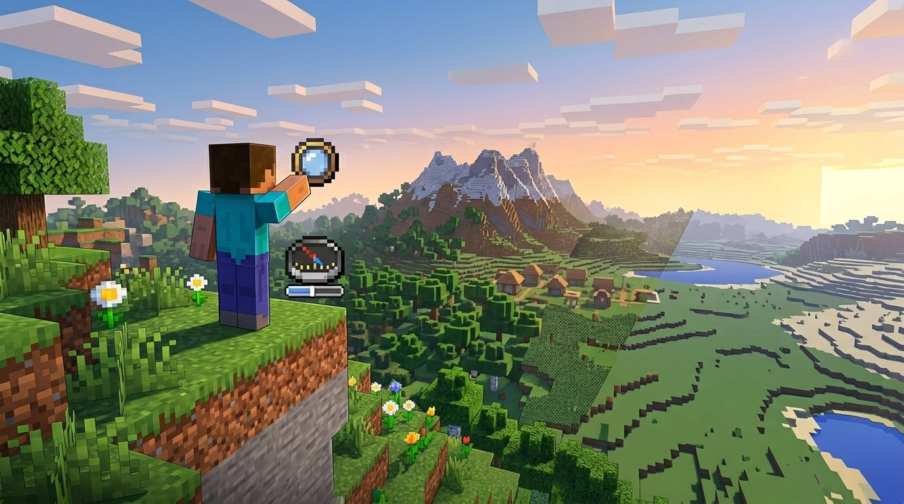

  

<h1 align="center">FPS Horizon</h1>

  
  
  

---

## 🇬🇧 English

**FPS Horizon** is a client-side Forge mod that dynamically adjusts render distance based on your average FPS, keeping the game smooth without any manual tweaking.

### ✨ Features

- **Dynamic render distance** — automatically increases or decreases render distance based on your average FPS
- **Animated fog transitions** — smooth distance fog hides chunk loading during render distance changes
- **Distance culling** — reduces GPU load by culling chunks and entities outside an ellipsoid shape
- **Culling profiles** — create custom culling configurations per render distance (exact value or range), saved to `fps_horizon_profiles.json`
- **Dynamic culling** *(experimental)* — automatically adjusts culling based on current render distance
- **Real-time configuration** — all settings changeable in-game from the Mods menu, no restart needed
- **Embeddium compatible** — fully integrated with Embeddium's rendering pipeline via Mixins
- **Client-side only** — works on any server

### 📋 Requirements

| Dependency | Version |
|---|---|
| Forge | See releases |
| Embeddium | 0.3.31+ |

### ⚙️ Configuration

All options available in-game via **Mods → FPS Horizon → Config**.

#### FPS Control
| Option | Default | Description |
|---|---|---|
| Min FPS | 30 | If average FPS drops below this, render distance decreases |
| Max FPS | 50 | If average FPS exceeds this, render distance increases |
| FPS Samples | 15 | Number of FPS samples to average before deciding a change |

#### Render Distance
| Option | Default | Description |
|---|---|---|
| Min Render Distance | 4 | The mod will never go below this value (chunks) |
| Max Render Distance | 12 | The mod will never exceed this value (chunks) |

#### Cooldown
| Option | Default | Description |
|---|---|---|
| Cooldown after decreasing | 30 ticks | Wait time after decreasing RD (20 ticks = 1 second) |
| Cooldown after increasing | 100 ticks | Wait time after increasing RD |

#### Fog
| Option | Default | Description |
|---|---|---|
| Enable Fog | true | Enables the distance fog that hides chunk loading |
| Fog Start | 0 blocks | Distance where fog begins |
| Fog End | 0.80 | Fraction of render distance where fog becomes fully opaque |
| Fog Close Factor | 0.80 | How aggressively the fog closes during a render distance change |
| Fog Speed | 0.05 | Animation speed of fog transitions (0.01 = slow, 0.5 = fast) |

#### Culling
| Option | Default | Description |
|---|---|---|
| Enable Culling | true | Enables distance-based chunk and entity culling |
| Vertical Scale | 2.00x | How aggressively chunks above/below are culled (0.50x–10.0x) |
| Horizontal Extension | 10% | Extends the render ellipsoid horizontally (0–100%) |
| Cull Entities | true | Applies culling to entities (mobs, items, etc) as well |
| Dynamic Culling *(experimental)* | false | Auto-adjusts culling based on current render distance |
| Profiles *(experimental)* | false | Use custom culling profiles per render distance |

**Dynamic Culling** adjusts automatically:
- RD 1–2: Vertical 0.50x, Horizontal 30%
- RD 3: Vertical 0.50x, Horizontal 40%
- RD 4+: Uses your configured slider values

**Culling Profiles** let you create named profiles with specific vertical/horizontal culling values for a given render distance (exact value or range). When active, the Vertical and Horizontal sliders are disabled and the matching profile is applied automatically. Profiles are saved in `fps_horizon_profiles.json` in your config folder.

#### Debug
| Option | Default | Description |
|---|---|---|
| Show RD changes | false | Shows render distance changes in the Action Bar |
| Verbose debug | false | Shows FPS, state, cooldown and culling info every tick |

### 🚀 Installation

1. Install [Minecraft Forge](https://files.minecraftforge.net/) for your version
2. Install [Embeddium 0.3.31+](https://modrinth.com/mod/embeddium)
3. Drop `fps-horizon-X.X.X.jar` into your `mods/` folder
4. Launch and configure via **Mods → FPS Horizon → Config**

### 📋 Changelog

**v1.1.0**
- Added distance culling system (chunks and entities via ellipsoid)
- Added culling profiles — custom vertical/horizontal values per render distance (exact or range)
- Added dynamic culling *(experimental)* — auto-adjusts culling for low render distances
- Fog transitions now also trigger on significant culling vertical scale changes
- Fixed fog initialization artifacts on world load

**v1.0.0**
- Initial release
- Dynamic render distance based on average FPS
- Animated fog transitions
- In-game config screen with categories
- Embeddium integration via Mixins

---

## 🇦🇷 Español

**FPS Horizon** es un mod cliente de Forge que ajusta automáticamente la distancia de renderizado según el promedio de FPS, manteniendo el juego fluido sin configuración manual.

### ✨ Características

- **Distancia dinámica** — aumenta o reduce el render distance según tus FPS promedio
- **Transiciones de niebla animadas** — niebla suave oculta la carga de chunks durante los cambios
- **Culling de distancia** — reduce la carga de GPU descartando chunks y entidades fuera de un elipsoide
- **Perfiles de culling** — configuraciones personalizadas de culling por distancia de renderizado, guardadas en `fps_horizon_profiles.json`
- **Culling dinámico** *(experimental)* — ajusta automáticamente el culling según la distancia actual
- **Configuración en tiempo real** — todo cambiable en el juego desde el menú de Mods, sin reiniciar
- **Compatible con Embeddium** — integrado con el pipeline de renderizado de Embeddium vía Mixins
- **Solo cliente** — funciona en cualquier servidor

### 📋 Requisitos

| Dependencia | Versión |
|---|---|
| Forge | Ver releases |
| Embeddium | 0.3.31+ |

### ⚙️ Configuración

Todas las opciones disponibles en **Mods → FPS Horizon → Config**.

#### Control de FPS
| Opción | Por defecto | Descripción |
|---|---|---|
| FPS Mínimos | 30 | Si el promedio baja de este valor, se reduce la distancia |
| FPS Máximos | 50 | Si el promedio supera este valor, se aumenta la distancia |
| Muestras de FPS | 15 | Cantidad de muestras a promediar antes de decidir un cambio |

#### Distancia de Renderizado
| Opción | Por defecto | Descripción |
|---|---|---|
| Distancia Mínima | 4 | El mod nunca bajará de este valor (chunks) |
| Distancia Máxima | 12 | El mod nunca superará este valor (chunks) |

#### Cooldown
| Opción | Por defecto | Descripción |
|---|---|---|
| Cooldown al bajar | 30 ticks | Espera tras reducir la distancia (20 ticks = 1 segundo) |
| Cooldown al subir | 100 ticks | Espera tras aumentar la distancia |

#### Niebla
| Opción | Por defecto | Descripción |
|---|---|---|
| Activar Niebla | true | Activa la niebla que oculta la carga de chunks |
| Inicio de Niebla | 0 bloques | Distancia donde empieza la niebla |
| Fin de Niebla | 0.80 | Fracción de la distancia donde la niebla se vuelve opaca |
| Factor de Cierre | 0.80 | Qué tan agresivo es el cierre de niebla durante un cambio |
| Velocidad de Niebla | 0.05 | Velocidad de animación (0.01 = lento, 0.5 = rápido) |

#### Culling
| Opción | Por defecto | Descripción |
|---|---|---|
| Activar Culling | true | Activa el culling de chunks y entidades por distancia |
| Escala Vertical | 2.00x | Qué tan agresivamente se descartan chunks arriba/abajo (0.50x–10.0x) |
| Extensión Horizontal | 10% | Extiende el elipsoide horizontalmente (0–100%) |
| Culling de Entidades | true | Aplica el culling también a entidades (mobs, items, etc) |
| Culling Dinámico *(experimental)* | false | Ajusta automáticamente el culling según la distancia actual |
| Perfiles *(experimental)* | false | Usá perfiles de culling personalizados por distancia de renderizado |

**Culling Dinámico** ajusta automáticamente:
- RD 1–2: Vertical 0.50x, Horizontal 30%
- RD 3: Vertical 0.50x, Horizontal 40%
- RD 4+: Usa tus valores configurados

**Perfiles de Culling** — creá perfiles con nombre y valores específicos de culling vertical y horizontal para una distancia de renderizado dada (valor exacto o rango). Cuando está activo, los sliders de Vertical y Horizontal se deshabilitan y se aplica el perfil que corresponda automáticamente. Los perfiles se guardan en `fps_horizon_profiles.json` en tu carpeta de config.

#### Debug
| Opción | Por defecto | Descripción |
|---|---|---|
| Mostrar cambios de RD | false | Muestra los cambios de distancia en el Action Bar |
| Debug detallado | false | Muestra FPS, estado, cooldown e info de culling en cada tick |

### 🚀 Instalación

1. Instalá [Minecraft Forge](https://files.minecraftforge.net/) para tu versión
2. Instalá [Embeddium 0.3.31+](https://modrinth.com/mod/embeddium)
3. Copiá `fps-horizon-X.X.X.jar` en tu carpeta `mods/`
4. Iniciá el juego y configurá desde **Mods → FPS Horizon → Config**

### 📋 Changelog

**v1.1.0**
- Sistema de culling por distancia (chunks y entidades vía elipsoide)
- Perfiles de culling — valores personalizados por distancia de renderizado (exacto o rango)
- Culling dinámico *(experimental)* — ajusta automáticamente para distancias bajas
- Las transiciones de niebla ahora también se disparan ante cambios significativos de culling vertical
- Corregido bug de inicialización de niebla al cargar el mundo

**v1.0.0**
- Lanzamiento inicial
- Distancia de renderizado dinámica basada en FPS promedio
- Transiciones de niebla animadas
- Pantalla de configuración ingame con categorías
- Integración con Embeddium vía Mixins

---

Made with ❤️ by <a href="https://github.com/Kratos-PalletTown">Kratos</a>

